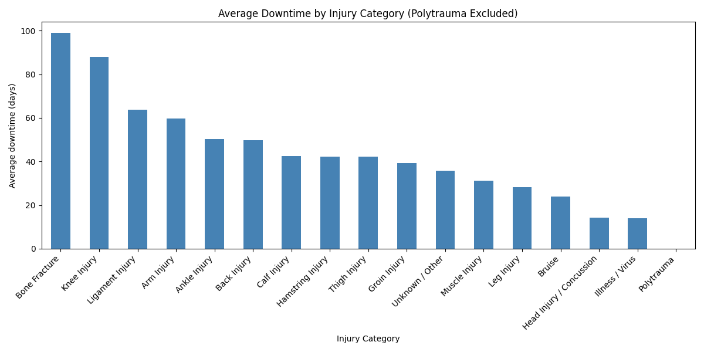
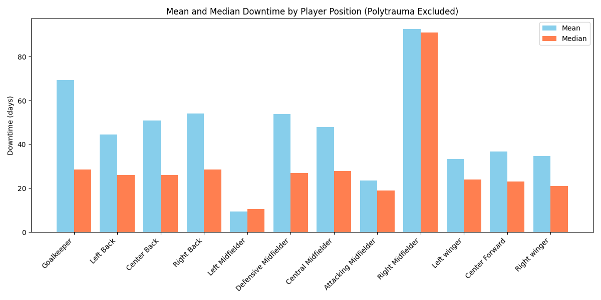
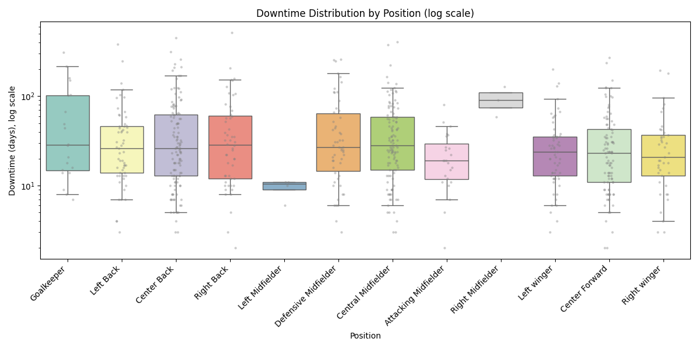
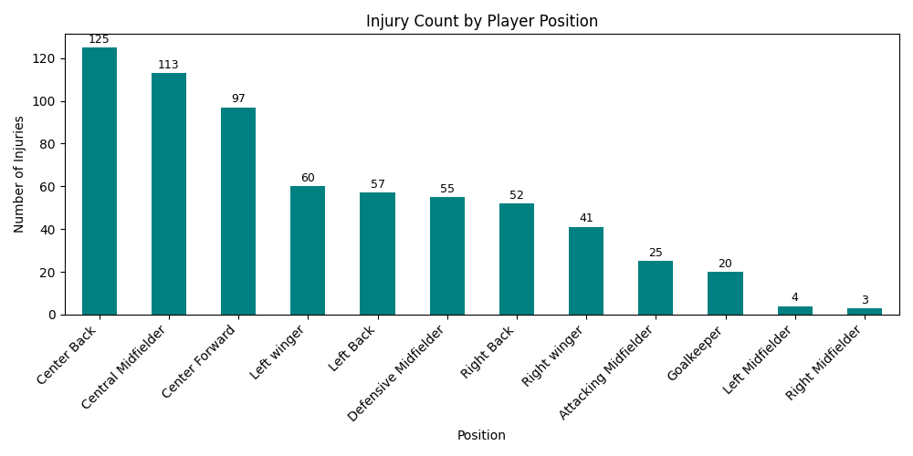
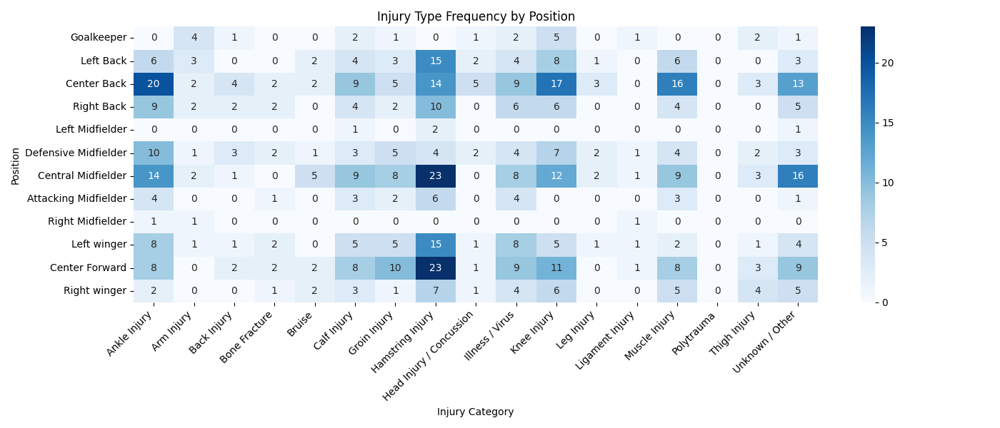

# \#EPL-injuries-analysis

## Abstract
Research of the impact of injuries on player performance, correlation analysis and data visualization.

## Conclussion
See detailed findings in [`notebooks/injury_analysis_summary.ipynb`](notebooks/injury_analysis_summary.ipynb).*

*Briefly: Central backs and central midfielders suffer the most injuries, goalkeepers have the highest median recovery time, wide midfielders and wingers have the fewest injuries. For further details and analysis limitations, see the conclusion in the notebook.*

##  Main Visualizations

### Chart 1: Average by Injury Category

### Chart 2: Mean and Median by Position

### Chart 3: Downtime Distribution by Position (Boxplot)

### Injury Count by Player Position

### Injury Type Frequency by Position (Heatmap)

## Streamlit Interactive Dashboard

You can run an interactive web app to explore the main analytics:

``bash
streamlit run app/streamlit_app.py

\## Used apps

* Python (Pandas, Matplotlib...)
* SQL (SQLite)
* Excel
* Streamlit
* GitHub

\## Project Structure

\- `data/` – initial and edited data

\-`notebooks/` – Jupyter Notebook for dataanalysys

\-`scripts/` – scripts for data processing

\- `visualizations/` – visualizations and graphs

\- `app/` – apps for visualization and analysys

\- `results/` – endresults

\## Author

Janibek Magmurov

